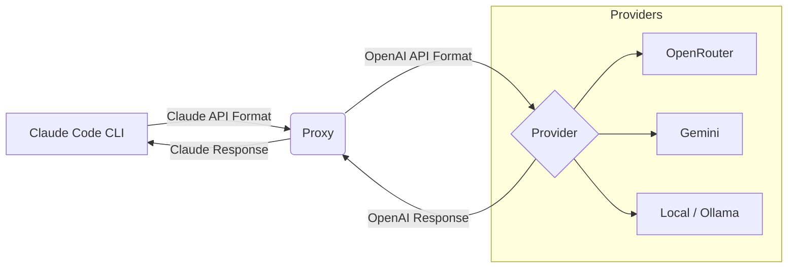

# Skill: Environment Configuration

## Description
This skill provides the knowledge to configure the runtime environment for agents. It specifically covers the construction of the `.claude` configuration folder (the agent's "brain") and the settings for the `claude-code-proxy` (the agent's "gateway").

## Capabilities

### 1. `.claude` Configuration Strategy
The `.claude` folder determines an agent's personality, tools, and constraints.

**Structure**:
```text
.claude/
├── CLAUDE.md          # Primary instructions, tone, and directives
├── config.json        # Tool & Permission settings
├── agents/            # Sub-agent definitions (.md files)
├── skills/            # Capability definitions (dirs or files)
└── hooks/             # Python scripts for monitoring/lifecycle events
```

**Selection Logic**:
- **Agents**: Select based on task (e.g., `coder.md` for coding, `researcher.md` for analysis).
- **Skills**: Add capabilities like `git-mastery` or `web-search-advanced`.
- **Hooks**: **ALWAYS** include core monitoring hooks (`session-start`, `output-logger`, `stall-detector`) to ensure visibility in the Dashboard.

### 2. Proxy Configuration (`claude-code-proxy`)
The proxy manages model routing and cost control.

**Configuration**:
- **Env Vars**:
  - `ANTHROPIC_BASE_URL`: Point to Proxy URL (e.g. `http://localhost:8082`)
  - `PROXY_AUTH_KEY`: Authentication for the proxy.
- **Routing Rules**:
  - Configure `router_config.json` in the proxy directory to map model IDs to providers (Anthropic, Gemini, OpenAI, etc.).

### 3. Prime Council Integration
The "Prime Council" (`prime_council_generator.py`) automatically synthesizes these configurations based on a prompt.
- **Input**: User Prompt (Natural Language).
- **Process**: Heuristic/LLM analysis of requirements.
- **Output**: Fully populated `.claude` directory injected into the target sandbox.

**Best Practice**:
When configuring an environment manually, ensure you replicate the Prime Council's "Clean Core" approach: Start with a base monitoring configuration and overlay specific tools.

## Reference: Claude Code Proxy Documentation
The following is the official documentation for the `claude-code-proxy` component used in this environment:

<div align="center">

# 🔄 Claude Code Proxy

**Use Claude Code CLI with any OpenAI-compatible provider**

[](https://www.python.org/downloads/)
[](https://opensource.org/licenses/MIT)

[Quick Start](#-quick-start) • [Features](#-features) • [Configuration](docs/getting-started/configuration.md) • [Examples](docs/guides/examples.md)

</div>

---

## 📖 What It Does

Claude Code Proxy sits between Claude Code CLI and your chosen API provider. It tricks Claude Code into thinking it's talking to Anthropic, but routes requests to **OpenRouter, Gemini, OpenAI, Azure, Ollama, or LM Studio**.

**Why?** Save money, run locally, or use models like GPT-5/o1/Gemini 2.0.

---

## 🚀 Quick Start

1. **Clone and Install**
   ```bash
   git clone https://github.com/aaaronmiller/claude-code-proxy.git
   cd claude-code-proxy
   uv sync
   ```

2. **Setup**
   Run the interactive setup wizard to configure your provider and models:
   ```bash
   python start_proxy.py --setup
   ```

3. **Start Proxy**
   ```bash
   python start_proxy.py
   ```

4. **Connect Claude Code**
   In a separate terminal:
   ```bash
   export ANTHROPIC_BASE_URL=http://localhost:8082
   claude
   ```

## 📂 Project Structure

The repository is organized for clarity and ease of use:

- **`start_proxy.py`**: The single entry point for the server and all CLI tools.
- **`config/`**: Configuration templates and presets.
- **`data/`**: Runtime data (databases, logs, usage stats).
- **`deploy/`**: Deployment configurations (Docker, etc.).
- **`docs/`**: Comprehensive documentation.
- **`scripts/`**: Developer and maintenance scripts.
- **`src/`**: Source code.

## 🛠️ CLI Tools

All tools are accessible via `start_proxy.py`:

- **Setup Wizard**: `python start_proxy.py --setup`
- **Configure Prompts**: `python start_proxy.py --configure-prompts`
- **Configure Terminal**: `python start_proxy.py --configure-terminal`
- **Configure Dashboard**: `python start_proxy.py --configure-dashboard`
- **View Analytics**: `python start_proxy.py --analytics`
- **Select Models**: `python start_proxy.py --select-models`

---

## 🧩 How It Works



---

## ✨ Features

- **💰 Cost Savings**: Use free models (Gemini Flash, OpenRouter free tier) or cheaper alternatives.
- **🏠 Local Privacy**: Run 100% offline with Ollama or LM Studio.
- **🧠 Extended Thinking**: Enable "thinking tokens" for reasoning models (o1, Gemini 2.0).
- **📊 Terminal Dashboard**: Live request monitoring and metrics.
- **🔀 Hybrid Routing**: Route simple tasks to cheap models and complex tasks to smart models.
- **✏️ Custom Prompts**: Inject custom system prompts for different model tiers.

---

## 📚 Documentation

- **[Configuration Guide](docs/getting-started/configuration.md)** - Full list of environment variables.
- **[Examples](docs/guides/examples.md)** - Recipes for different setups (Free, Local, Power User).
- **[Troubleshooting](docs/troubleshooting/common-issues.md)** - Solutions for common problems.
- **[API Reference](docs/api/reference.md)** - For developers.

---

## 🐛 Common Issues

**401 User Not Found (OpenRouter)**
You likely have a negative balance or $0.00 credit. OpenRouter requires a positive balance even for free models.
[Read more](docs/troubleshooting/401-errors.md)

**Connection Refused**
Make sure `python start_proxy.py` is running in a separate terminal window.

**Model Not Found**
Check your `BIG_MODEL`, `MIDDLE_MODEL`, and `SMALL_MODEL` settings in `.env`.
