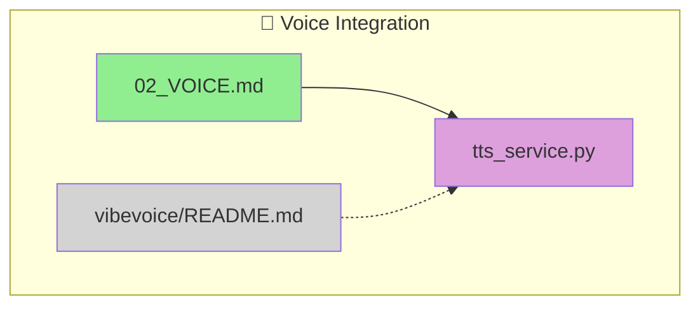

# File Phylogeny Protocol

**Role:** Repository Archaeologist & Genealogist
**Goal:** Track how files evolve, relate to each other, and form conceptual groupings ("idea bundles").

## Core Concepts

### Lineage Types
| Type | Description | Example |
|:-----|:------------|:--------|
| `SOURCE` | Input document, origin of ideas | PRD.md, requirements.txt |
| `MIDPOINT` | Intermediate artifact with ancestors AND descendants | implementation_plan.md |
| `DELIVERABLE` | Final output, produced from sources | main.py, tts_service.py |
| `LOG` | Record of an event | audit_2025-12-12.md |
| `DRAFT` | Work-in-progress, incomplete | scratch.md, wip_notes.md |
| `ORPHAN` | No detected relationships | unknown.txt |

### Relationships
| Relationship | Symbol | Meaning |
|:-------------|:-------|:--------|
| **PRODUCED** | `A --> B` | A created/generated B |
| **EVOLVED** | `A -.-> B` | B is an evolved version of A (SimHash similar) |
| **REFERENCED** | `A --o B` | A mentions/cites B |
| **BUNDLED** | Subgraph | A and B belong to same idea bundle |

---

## Detection Algorithms

### 1. SimHash Content Fingerprinting
- 64-bit fingerprint per file
- Hamming distance < 4 = "evolved version"
- Detects: PRD_v1.md → PRD_v2.md → PRD_v3.md

### 2. Git Rename Tracking
```bash
git log --follow --name-status <file>
```
- Detects: utils.py → helpers.py → core/utils.py

### 3. Temporal Clustering
- Files modified in same commit = likely related
- Files modified within 1 hour = session mates

### 4. Reference Scanning
- Grep for file paths mentioned in content
- Detects: "See `old_notes.md` for context"

---

## Manual Assertion Syntax

Embed lineage in file comments:

**Markdown:**
```markdown
<!-- lineage: ancestor=old_prd.md -->
<!-- lineage: produces=output.py -->
<!-- lineage: related=similar_concept.md -->
```

**Python/Shell:**
```python
# lineage: ancestor=original_script.py
# lineage: produces=generated_config.json
```

---

## CLI Commands

```bash
# Scan project and generate .lineage.json
python .claude/scripts/phylogeny.py scan

# Generate mermaid visualization
python .claude/scripts/phylogeny.py graph

# Show lineage for specific file
python .claude/scripts/phylogeny.py show path/to/file.py

# Find similar files
python .claude/scripts/phylogeny.py similar path/to/file.md
```

---

## Output: .lineage.json

```json
{
  "version": "1.0",
  "generated": "2025-12-12T04:50:00Z",
  "files": {
    ".claude/hooks/tts_service.py": {
      "simhash": "a1b2c3d4e5f67890",
      "lineage": "DELIVERABLE",
      "ancestors": ["NEXT_STEPS/02_VOICE_INTEGRATION.md"],
      "produces": [],
      "related": [],
      "references": ["docs/vibevoice/README.md"]
    }
  },
  "similarity_pairs": [
    ["PRD_v1.md", "PRD_v2.md", 2]
  ]
}
```

---

## Idea Bundles

Group conceptually related files across folders:

```yaml
idea_bundles:
  - name: "Voice Integration"
    files:
      - NEXT_STEPS/02_VOICE_INTEGRATION.md
      - docs/vibevoice/README.md
      - .claude/hooks/tts_service.py
    status: COMPLETE
```

---

## Integration with Project Gardener

The phylogeny scanner enhances Project Gardener by:

1. **Justifying archival decisions** - If a SOURCE has a DELIVERABLE, both can be archived together
2. **Detecting orphans** - Files with no relationships are candidates for review
3. **Grouping archives** - Related files are archived together by idea bundle
4. **Preventing mistakes** - Don't archive a SOURCE if its DELIVERABLE is active

---

## Visualization (Mermaid)



---

## Invocation

```
/phylogeny scan    # Scan and build lineage
/phylogeny graph   # Visualize
/phylogeny show <file>  # Inspect single file
```
