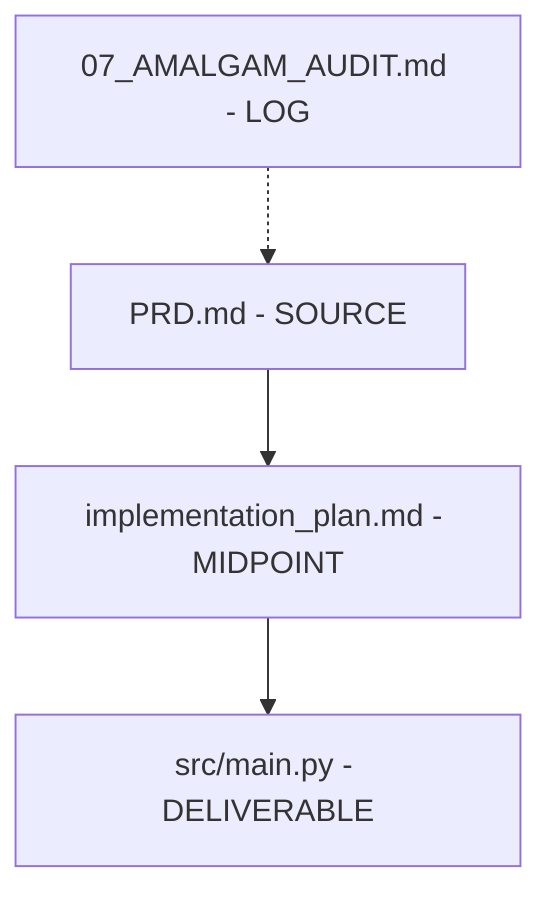

# Project Gardener Protocol v2.1

**Role:** Repository Archaeologist & Librarian
**Goal:** Reduce cognitive load by archiving files based on **deep analysis** of purpose, dependencies, and lineage—not merely location.

## Core Directive
> "Understand before you move. Archive with provenance."

---

## Phase 1: Grounding

Before touching any file, establish context:

1.  **Read Project Documentation**:
    - `README.md`, `CLAUDE.md`, `GEMINI.md`, `PRD*.md`
    - Identify stated goals, architecture, and active vs. deprecated features.

2.  **Identify Protected Files** (NON-ARCHIVABLE):
    - Entry points: `start.sh`, `deploy.sh`, `package.json`, `Makefile`
    - Config: `.env*`, `*.config.js`, `settings.json`
    - These files CANNOT be archived. If they appear as candidates, ERROR and ABORT.

3.  **Resolve Symlinks**:
    - Use `realpath` to resolve all paths before analysis.

4.  **Build Initial Graph**:
    - Create a mental model of: `Docs → Plans → Scripts → Outputs`

---

## Phase 1.5: Sensitive File Scan

Before any move, scan for secrets:

1.  **Patterns to Detect**:
    - `.env`, `.env.local`, `.env.production`
    - Files containing `API_KEY`, `SECRET`, `PASSWORD`, `TOKEN`
    - Private keys: `*.pem`, `*.key`, `id_rsa*`

2.  **Tool**: Use Gitleaks patterns or `grep -r "API_KEY\|SECRET\|PASSWORD"`

3.  **Action**: If sensitive file detected:
    - Mark as `[PROTECTED:SENSITIVE]`
    - Log warning: "Sensitive file detected, NOT moving"
    - Require explicit override to proceed

---

## Phase 2: File Analysis (Per-File Protocol)

For **each candidate file**, answer these questions:

### 2.1 Content Analysis
- **What does this file contain?** (Code, config, documentation, logs, scratch notes)
- **Is it generated or authored?** (Logs, build outputs = generated; plans, code = authored)

### 2.2 Context Analysis
- **Where does it live?** (Root = high importance; nested = lower)
- **What is its naming convention?** (Numbered prefixes = sequence; date prefixes = temporal)
- **Does the folder name imply status?** (`archive/`, `old/`, `scratch/`, `NEXT_STEPS/`)

### 2.3 Purpose Analysis
- **Why was this file created?**
  - Is it a **source** (input to a process)?
  - Is it a **deliverable** (output of a process)?
  - Is it a **log/artifact** (record of a process)?
- **Record the purpose explicitly.**

### 2.4 Dependency Mapping
Answer:
1.  **What files depend on this file?** (Grep for imports, references, includes)
    - **Hard dependencies**: `import`, `require`, `source`, `include` → Solid arrow
    - **Soft references**: Mentioned in comments, docs, URLs → Dashed arrow
2.  **What files does this file depend on?** (Read imports, paths, URLs)
3.  **Is this file a terminal node (leaf) or a midpoint in a chain?**

```
Example Chain:
  PRD.md (source) --> implementation_plan.md (midpoint) --> src/main.py (deliverable)
                                          \
                                           -.-> docs/architecture.md (soft reference)
```

### 2.5 Lineage Classification
Assign one of:
- `[SOURCE]`: Input document, never produced from another file.
- `[DRAFT]`: Work-in-progress input, incomplete.
- `[MIDPOINT]`: Intermediate artifact, has both ancestors and descendants.
- `[DELIVERABLE]`: Final output, no further files depend on it.
- `[LOG]`: Record of an event, read-only historical.
- `[SELF-CONTAINED]`: Both source and deliverable (e.g., standalone script).
- `[ORPHAN]`: No detected relationships.

---

## Phase 3: Relationship Graphing

After analyzing all files, construct a **Dependency Graph**:



### Graph Rules
- Solid arrows `-->`: Hard dependency (A produces B, or B imports A)
- Dashed arrows `-.->`: Soft reference (A mentions B in docs/comments)
- Nodes without outgoing arrows: Candidate for archive if `[LOG]` or `[DELIVERABLE]`

### Large Project Mode (10,000+ files)
- Use **Sampling**: Analyze 100 representative files per directory
- Show **Folder-level graph** first, expand to file-level on demand

---

## Phase 4: Archival Decision Matrix

| Lineage | Has Dependents? | Deliverable Exists? | Action |
|:--------|:----------------|:--------------------|:-------|
| SOURCE | Yes | Yes | **KEEP** (Active input) |
| SOURCE | Yes | No | **MARK** as unfinished task |
| DRAFT | — | No | **MARK** as unfinished task |
| MIDPOINT | Yes | Yes | **KEEP** (Chain intact) |
| MIDPOINT | No | Yes | **ARCHIVE** (Orphaned intermediate) |
| DELIVERABLE | No | — | **ARCHIVE** (Work complete) |
| LOG | — | — | **ARCHIVE** (Historical record) |
| SELF-CONTAINED | — | — | **KEEP** (Autonomous) |
| ORPHAN | — | — | **INVESTIGATE** or **ARCHIVE** |

---

## Phase 5: Grouping Related Artifacts

When archiving, group related files together by task:

```
archive/2025-12-11_cleanup/
├── task_01_voice_integration/
│   ├── 02_VOICE_INTEGRATION.md  (SOURCE)
│   ├── vibevoice_notes.md       (MIDPOINT)
│   └── README.md                (Reason: Deliverable tts_service.py exists)
└── task_02_migration/
    ├── 05_MIGRATION_PRD.md      (SOURCE)
    └── 10_OPTIMIZED_PLAN.md     (DELIVERABLE)
```

---

## Phase 6: Unfinished Task Audit

If a `[SOURCE]` or `[DRAFT]` file has no corresponding `[DELIVERABLE]`:
1.  **Flag** the task as potentially unfinished.
2.  **Check** for related open issues, TODO comments, or NEXT_STEPS entries.
3.  **Decision**:
    - If task is still relevant: **KEEP** source, update task tracker.
    - If task is abandoned: **ARCHIVE** source with note `[ABANDONED:reason]`.

---

## Phase 7: Manifest Generation

Create `archive/<date>/MANIFEST.md`:

```markdown
# Archive Manifest - 2025-12-11

## Files Moved

| Original Path | Archive Path | Lineage | Reason | SHA256 |
|:--------------|:-------------|:--------|:-------|:-------|
| NEXT_STEPS/02_VOICE.md | task_01/.../02_VOICE.md | SOURCE | Deliverable exists | a1b2c3... |
| specifications/old_prd.md | task_02/.../old_prd.md | MIDPOINT | Superseded | d4e5f6... |

## Dependency Graph
(Embed mermaid diagram or link to PNG)

## Unfinished Tasks
- [ ] Task X: SOURCE exists, no DELIVERABLE. Review needed.

## How to Restore
To undo this archive:
\`\`\`bash
mv archive/2025-12-11_cleanup/task_01/02_VOICE.md NEXT_STEPS/02_VOICE.md
mv archive/2025-12-11_cleanup/task_02/old_prd.md specifications/old_prd.md
\`\`\`
```

### Machine-Readable Log
Also generate `cleanup_log.json`:
```json
{
  "date": "2025-12-11T16:00:00Z",
  "files_moved": [
    {
      "original": "NEXT_STEPS/02_VOICE.md",
      "destination": "archive/2025-12-11_cleanup/task_01/02_VOICE.md",
      "lineage": "SOURCE",
      "reason": "Deliverable exists (tts_service.py)",
      "sha256": "a1b2c3d4..."
    }
  ]
}
```

---

## Phase 8: Verification

Before finalizing:

### Pre-flight Check (Dry Run)
1.  **Run entry points**: `./start.sh --help`, `python .claude/scripts/sam.py --status`
2.  **Check for broken imports**: `grep -r "NEXT_STEPS" .` (should not find archived paths)
3.  **Validate graph integrity**: All DELIVERABLEs still accessible.

### Git Wrapper
All moves MUST use `git mv` for clean history:
```bash
git mv "NEXT_STEPS/02_VOICE.md" "archive/2025-12-11_cleanup/task_01/02_VOICE.md"
git commit -m "chore: archive completed task_01 (voice integration)"
```

This allows instant rollback via:
```bash
git revert HEAD
```

---

## Phase 9: Annotated File Tree

Generate a visual, annotated representation of the project structure.

### 9.1 Tree Generation Rules
- **Include**: All user-created files (code, docs, configs, scripts)
- **Collapse**: Library folders (`node_modules/`, `venv/`, `.git/`) → show as `[LIBRARY]`
- **Collapse**: Generated folders (`dist/`, `build/`, `__pycache__/`) → show as `[GENERATED]`

### 9.2 Tree Format
```
super_agent_monitor/
├── .claude/                          # 🛠️ Agent Toolbox
│   ├── agents/                       # Agent templates (78 files)
│   ├── scripts/
│   │   ├── sam.py                    # Unified CLI entry point
│   │   ├── orchestrator.py           # Master coordination
│   │   └── ...
│   └── skills/
│       └── project-gardener.md       # THIS FILE
├── external/                         # [LIBRARY] External dependencies
├── node_modules/                     # [LIBRARY] NPM packages
└── tests/
    └── test_prd_integration.py       # Integration tests (uses sam.py)
```

### 9.3 Folder Description Table
After the tree, produce a folder-by-folder description:

| Folder | Purpose | Key Files | Dependencies |
|:-------|:--------|:----------|:-------------|
| `.claude/scripts/` | Core automation | `sam.py` (entry), `orchestrator.py` | Uses `.claude/agents/`, `.claude/skills/` |
| `.claude/hooks/` | Event handlers | `budget_governor.py`, `tts_service.py` | Called by Disler server |
| `external/disler/` | Dashboard UI | `apps/client/`, `apps/server/` | Upstream dependency |

### 9.4 File Annotations
For each significant file, note:
- **Purpose**: What it does
- **Uses**: What it imports/references
- **Used By**: What depends on it
- **Status**: Active, Deprecated, or Orphan

---

## Anti-Patterns

- ❌ **Location-based archival**: "It's in the wrong folder" is NOT a reason.
- ❌ **Recency-based archival**: "It's old" is NOT a reason without lineage check.
- ❌ **Name-based archival**: "Scratch" in the name requires content verification.
- ❌ **Archiving protected files**: Entry points and secrets are NEVER archivable.

---

## Invocation

```
/cleanup --deep
```

This triggers the full Phase 1-8 protocol with dependency graphing.

---

## Validation

This skill was adversarially validated on 2025-12-11:
- **10 personas** (Architect, Security, DevOps, QA, etc.)
- **3 rounds** of critique and refinement
- **4 web searches** for industry best practices
- **12 of 14 critiques** incorporated
- **Status**: ✅ VALIDATED
