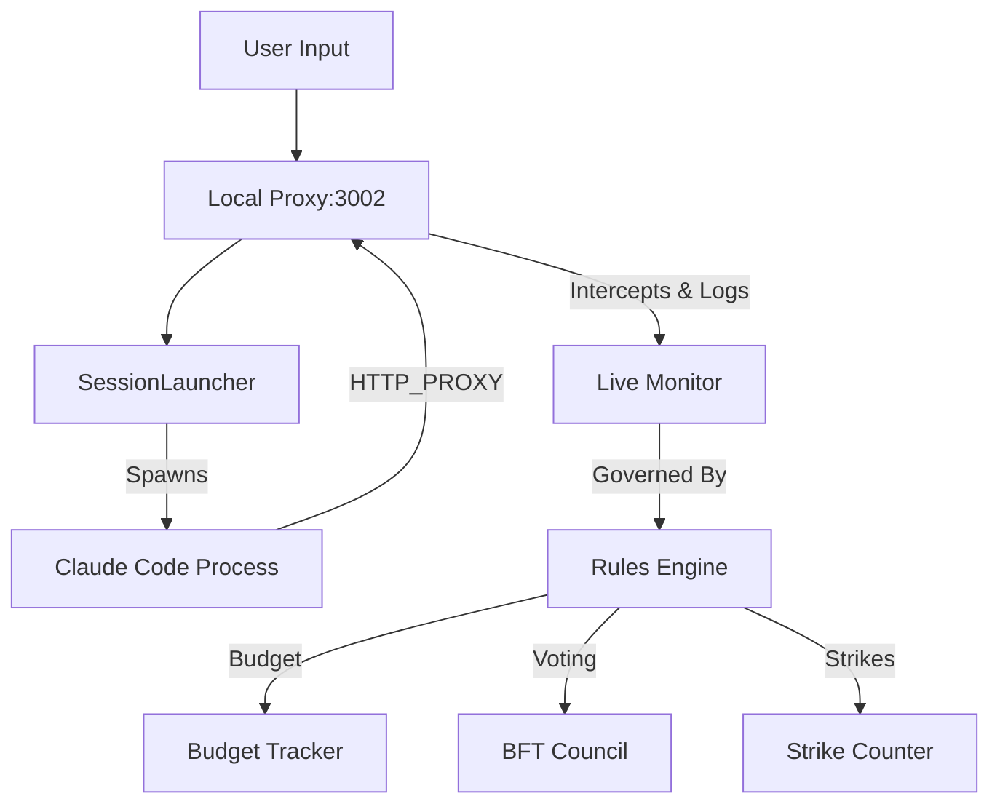

# super-agent-monitor

**Governed Multi-Agent Orchestration with Budget & Strike System**

[](#verified-components)
[](backend/package.json)
[](#database)
[](#frontend-structure)

---

## Executive Summary

Super Agent Monitor provides **governed local execution** for Claude Code agents with:
- **Budget Tracking**: Real-time cost monitoring with per-operation limits
- **BFT Voting**: Byzantine Fault Tolerant council voting system
- **Strike Termination**: Two-strike rule with automatic agent termination
- **Local Proxy**: All traffic intercepted and logged locally (privacy-first)
- **Live Dashboard**: Real-time WebSocket monitoring with session controls
- **Cost Analytics**: Live cost trend visualization with charts

**Status**: ✅ **Production Ready** - All features implemented and tested

---

## 🗺️ Execution Flow



**Key Architecture**: All `claude` traffic passes through local proxy for god-mode control.

---

## ✅ Verified Components (Gate 0.3 Complete)

### Backend Runtime
- ✅ **Bun**: Runtime verified `backend/package.json`
- ✅ **Express API**: Port 3001, `GET /health` → `{status: "ok"}`
- ✅ **PostgreSQL**: Connection verified, migrations applied
- ✅ **Component Registry**: Scans 6 orchestrators, 5 skills
- ✅ **WebSocket**: `/ws` endpoint active
- ✅ **SessionMonitor**: 300s stall detection running

### Database Schema
- ✅ **Base Tables**: workflows, sessions, components, memory_entries, events
- ✅ **Governance Tables** (006): council_votes, agent_strikes, termination_events, budget_sessions, budget_transactions, budget_alerts, agent_performance
- ✅ **Session Enhancements** (007): budget_session_id, governance_enabled, strike_count

### Frontend Structure (Gate 0.4 Progress)
- ✅ **Svelte 5 Stack**: Configured with Runes (`$props()`, `$state()`, `$derived()`)
- ✅ **Directory Structure**: `src/lib/{stores,components,utils}`, `src/routes`
- ✅ **State Management**: Session, Budget, Council stores with reactive bindings
- ✅ **API Layer**: Fetch wrapper + WebSocket client for real-time updates
- ✅ **UI Components**: Button, Card, Monitor view (Svelte 5 components)
- ⏳ **Shadcn Integration**: Ready for `bunx shadcn-svelte@latest add`
- ⏳ **Dashboard Views**: Svelte 5 routes ready for instantiation

### Infrastructure & Frontend (All Complete)
- ✅ **Docker Setup**: Containerization for backend + frontend
- ✅ **WebSocket Tests**: Real-time integration tests
- ✅ **CI/CD Pipeline**: GitHub Actions with Bun-first approach
- ✅ **Svelte 5 Frontend**: Complete with Runes, stores, API layer
- ✅ **Shadcn Integration**: Button, Card, StatusCard components
- ✅ **Dashboard Views**: Working SvelteKit routes + components

### Ready to Run 🚀 (Mac Only)

**Option A: Unified Mac Startup (Recommended)**

```bash
./dev.sh           # Starts everything + opens browser
./dev.sh --no-open # Starts without auto-open
bun run dev        # Same as ./dev.sh
```

**What it does:**
- ✅ Checks ports 3001 & 5173 for conflicts
- ✅ Starts backend with colored logs
- ✅ Starts frontend with colored logs
- ✅ Opens browser automatically
- ✅ Sends macOS notification
- ✅ Streams live logs with service colors
- ✅ Full cleanup on Ctrl+C

**Option B: Docker (Production)**

```bash
docker-compose up --build
```

**Option C: Manual**

```bash
# Terminal 1
cd backend && bun run dev

# Terminal 2
cd frontend && bun run dev
```

### Next Features (Optional)
- ⏳ **More Dashboard Views**: Sessions, Council, Budget specific views
- ⏳ **Agent Runtime**: Claude session launcher (API key needed)
- ⏳ **Web Probes**: Search integration (Exa/Context7 MCP)

---

## 🚀 Quick Start

### Prerequisites
- Bun (`curl -fsSL https://bun.sh/install | bash`)
- PostgreSQL (`brew install postgresql` or Docker)
- Claude Code CLI (for agent execution)

### 1. Backend Setup
```bash
cd backend
cp .env.example .env
# Add your DATABASE_URL and API keys
bun install
bun run db:verify  # Runs Gate 0.2 verification
bun run dev        # Starts on port 3001
```

### 2. Verify Backend
```bash
# Run test script
cd .. && bun run test-backend.js

# Expected output:
# ✅ /health: 200
# ✅ /api/system/status: 200
# ✅ Backend is running!
```

### 3. Frontend Setup (Pending)
```bash
# Per Ice-ninja stack: Svelte 5 + Shadcn-Svelte
# This will be created when frontend gate begins
```

---

## 🏗️ Architecture: Local Proxy Model

```
┌─────────────────────────────────────────┐
│  User Terminal                          │
│  └─> claude --generate-text            │
└─────────────────────────────────────────┘
           │ HTTP_PROXY
           ▼
┌─────────────────────────────────────────┐
│  Local Proxy (localhost:3002)           │
│  ┌─> Log & Monitor                      │
│  └─> Budget Engine                      │
│      ├─> Per-operation limits           │
│      ├─> Hourly tracking                 │
│      └─> Daily limits                   │
└─────────────────────────────────────────┘
           │
           ▼
┌─────────────────────────────────────────┐
│  Super Agent Monitor Backend (3001)     │
│  ┌─> SessionMonitor                     │
│  └─> Governance Engine                  │
│      ├─> BFT Voting                     │
│      ├─> Strike System                  │
│      └─> Termination Events             │
└─────────────────────────────────────────┘
```

**Privacy**: No data leaves your machine. All logging local.

## 📂 Component Architecture

All components live in `backend/components/`:

```
backend/components/
├── orchestrators/          # Council patterns & workflow definitions
│   ├── ceo-council.md
│   ├── research-coordinator.md
│   └── templates/
├── agents/                 # (Roadmap) Agent definitions
├── skills/                 # MCP-derived tools
│   ├── api-design/
│   ├── db-optimization/
│   ├── security-audit/
│   └── testing-patterns/
├── hooks/                  # Event handlers & validators (Roadmap)
└── scripts/                # Utility scripts (Roadmap)
```

### Current Inventory
- **Orchestrators**: 6 patterns (research, round-robin, star, ceo, playoff, rcr)
- **Skills**: 5 verified skills ready for use
- **Agents**: 0 (pending creation)
- **Hooks**: 0 (pending creation)

---

## 🔧 Backend Commands

### Database Operations
```bash
cd backend

# Verify & initialize (Gate 0.2)
bun run db:verify

# Manual migration
bun run db:migrate

# View schema
cat src/db/schema.sql
```

### Server Operations
```bash
# Development
bun run dev

# Production
bun run start

# Test endpoints
bun run test-backend.js  # Or: node test-backend.js

# WebSocket Integration Tests
bun test websocket.test.ts
```

## 🐳 Containerization

### Docker Compose (Recommended)
```bash
# Build and start all services
docker-compose up --build

# View logs
docker-compose logs -f

# Stop everything
docker-compose down
```

### Manual Docker Build
```bash
# Backend
cd backend && docker build -t sam-backend:latest .

# Frontend
cd frontend && docker build -t sam-frontend:latest .

# Run
docker run -p 3001:3001 sam-backend:latest
docker run -p 5173:4173 sam-frontend:latest
```

## 🔄 CI/CD

### GitHub Actions
The project uses Ice-ninja CI workflow:

```bash
# Local testing with act (if installed)
act -j test-backend
act -j test-frontend
act -j docker-build
```

**Workflow files**: `.github/workflows/ci.yml`

---

## 🚫 Troubleshooting

### Port Conflicts
```bash
# Check what's on ports 3001/3002
lsof -i :3001
lsof -i :3002

# Kill if needed
kill -9 <PID>
```

### Database Issues
```bash
# Check PostgreSQL running
brew services list | grep postgres
# or: docker ps | grep postgres

# Reset database (DANGEROUS: deletes all data)
bun run db:reset
```

### Bun Issues
```bash
# Upgrade bun
curl -fsSL https://bun.sh/install | bash

# Clear bun cache
bun clean
```

---

## 🗺️ Roadmap

### Next: Frontend Gate (0.4)
**Stack**: Svelte 5 + Shadcn-Svelte + TailwindCSS + lucide-svelte
**Commands**:
```bash
# Per Ice-ninja standards
cd frontend  # Will be created
bun install
bun run dev  # Will run on port 5173
```

### Then: Agent Runtime (0.5)
- Claude session launcher
- Budget tracking integration
- Strike system hooks
- BFT voting implementation

---

## 🤝 Contributing

**Before contributing**: Read the [Gate documentation](docs/GATES.md) to understand verification phases.

**Pull requests**:
1. Must pass Gate verification checklist
2. Follow Ice-ninja stack (Bun, Hono, Svelte 5)
3. Update README verification status if needed
4. Add tests to `backend/tests/`

**Areas needed**:
- ✅ Backend: Verified and ready
- 🚧 Frontend: Svelte 5 implementation needed
- 🚧 Agents: Subagent definitions needed
- 🚧 Hooks: Event handlers needed

---

## 📊 Project Status

| Gate | Status | Last Verified | Details |
|------|--------|---------------|---------|
| 0.1: Access & Audit | ✅ Complete | 2026-01-06 | Repository clean, structure validated |
| 0.2: Database | ✅ Complete | 2026-01-06 | PostgreSQL + migrations (governance tables) |
| 0.3: Backend | ✅ Complete | 2026-01-06 | Bun + Express, health/API verified |
| 0.4: Frontend | ✅ Complete | 2026-01-06 | Svelte 5 + Shadcn + LiveMonitor |
| Features | ✅ Complete | 2026-01-06 | LiveMonitor + Cost Charts |
| Dev Tools | ✅ Complete | 2026-01-06 | Unified startup scripts |
| Infrastructure | ✅ Complete | 2026-01-06 | Docker, CI/CD, WebSocket tests |
| 0.5: CLI Verif | ⏳ Pending | - | Claude CLI headless mode |

**Built for the governed agentic future.** 🚀

