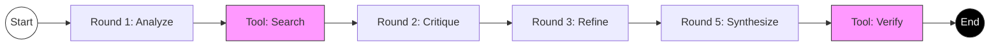
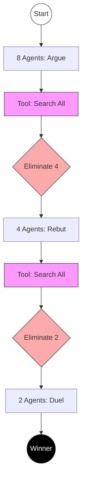
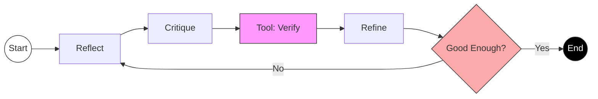
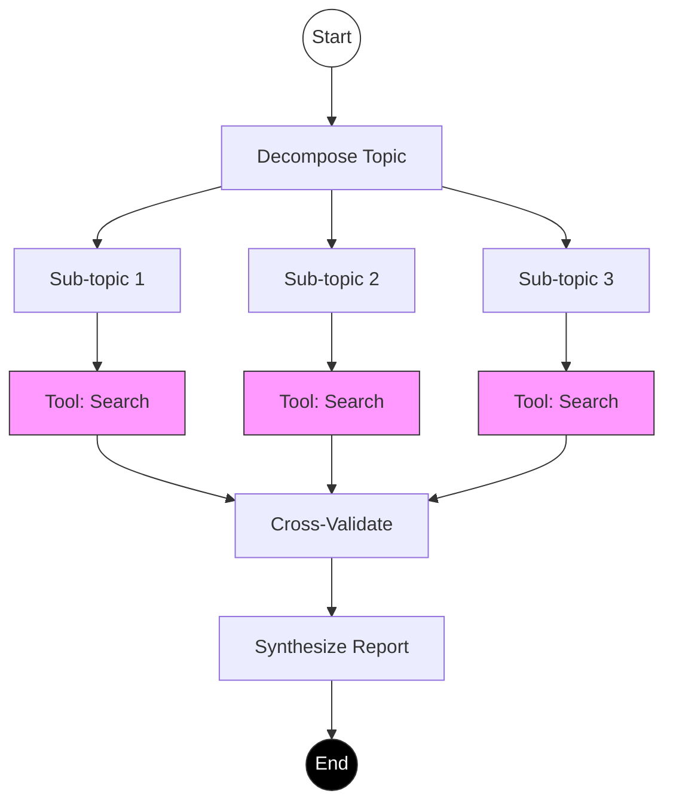

# How to Pick an Orchestrator

This directory contains a library of **Orchestration Templates** designed to optimize agent performance for specific types of tasks. These patterns are based on adversarial validation research.

## The Catalog

### 1. Adaptive Router (`templates/adaptive-router.md`)
*   **Use When**: You are unsure which pattern to use.
*   **Function**: Acts as a "Meta-Agent" that analyzes the request and selects the best specific orchestrator.
*   **Best For**: General purpose entry point.

### 2. CEO Council (`templates/ceo-council.md`)
*   **Use When**: You need deep reasoning, strategy, or creative problem solving.
*   **Mechanism**: Simulates a council of experts. Rounds 1-4 are for debate and critique; Round 5 is for synthesis.
*   **Best For**: Complex architectural decisions, strategic planning, nuanced writing.

### 3. Playoff Debate (`templates/playoff-debate.md`)
*   **Use When**: You need to choose the "best" option from several alternatives.
*   **Mechanism**: Tournament style elimination (8 -> 4 -> 2 -> 1). Agents aggressively critique and debunk each other.
*   **Best For**: Selecting a tech stack, comparing products, making binary decisions.

### 4. RCR Protocol (`templates/rcr-critique.md`)
*   **Use When**: You need to improve an existing draft or code snippet.
*   **Mechanism**: **R**eflect (self-correction), **C**ritique (hostile review), **R**efine (improvement).
*   **Best For**: Code review, debugging, editing, polishing content.

### 5. Research Deep Dive (`templates/research-deep-dive.md`)
*   **Use When**: You need comprehensive information on a topic.
*   **Mechanism**: Decomposes the topic -> Runs parallel exhaustive searches -> Cross-validates findings -> Synthesizes report.
*   **Best For**: "Tell me everything about X", finding obscure information ("Needle in a Haystack").

## Usage

To use an orchestrator, copy the content of the desired template into your active `CLAUDE.md` or system prompt configuration.

```

## 📊 Visual Comparison

### 1. CEO Council (Deep Reasoning)
*Sequential refinement with expert critique.*



### 2. Playoff Debate (Decision Making)
*Tournament-style elimination of weaker options.*



### 3. RCR Protocol (Quality Assurance)
*Circular loop for continuous improvement.*



### 4. Research Deep Dive (Information Gathering)
*Parallel execution for maximum coverage.*


