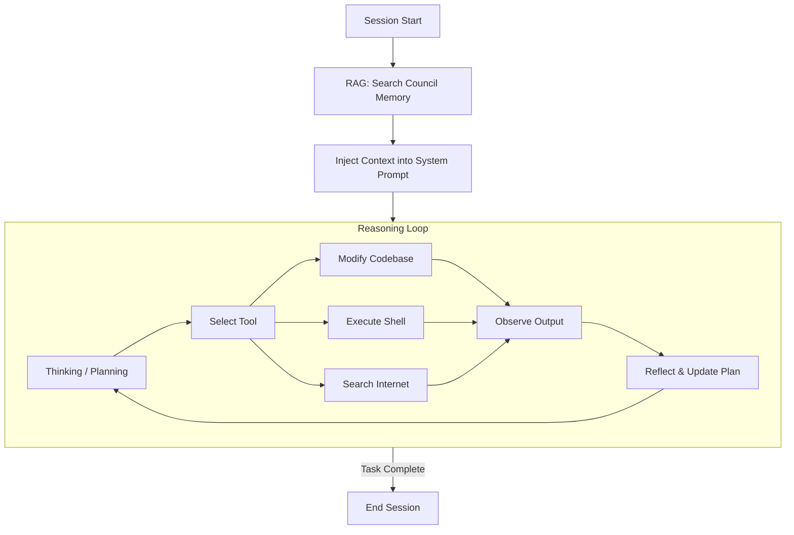

# Agent Lineages & Methodology

This document explains the internal reasoning processes ("lineages") of the agents within the Super Agent Monitor ecosystem.

## The Council Architecture (Orchestrator)

The "Council" is the primary reasoning engine. It follows a structured "Think-Act-Observe" loop, augmented by a "Council Memory" (RAG) at startup.

## Methodology

### Startup Context Injection (RAG)

- Before the agent starts, the system queries the Council Memory for relevant past sessions, code snippets, and outcomes.
- This context is injected into the System Prompt.
- **Goal:** Ground the agent in the project's history.

### Iterative Reasoning (The Loop)

1. **Thought:** The agent analyzes the current state and the user's request. It formulates a plan.
2. **Tool Use:** The agent selects a tool (e.g., `run_command`, `edit_file`) to execute a step of the plan.
3. **Observation:** The agent reads the tool output (stdout, stderr, file content).
4. **Reflection:** The agent evaluates if the step was successful and adjusts its plan.

### Internet Grounding

- If the agent lacks information, it can use "Research Tools" (if enabled) to search the internet.
- **Note:** This is tool-dependent.

## Visual Aid: The Agent Loop

## Agent Lineages

Different "Orchestrators" (Council Architectures) define different "lineages" or styles of reasoning.

### 1. Default Orchestrator (`orchestrator:default`)

- **Style:** Balanced.
- **Method:** Standard ReAct (Reasoning + Acting) loop. Good for general coding tasks.

### 2. Planner Orchestrator (`orchestrator:planner`)

- **Style:** Methodical.
- **Method:**
  - **Phase 1:** Pure planning. No code changes. Creates a `PLAN.md`.
  - **Phase 2:** Execution. Follows `PLAN.md` strictly.
  - **Phase 3:** Verification. Runs tests to confirm `PLAN.md` goals.

### 3. Researcher Orchestrator (`orchestrator:researcher`)

- **Style:** Exploratory.
- **Method:** Prioritizes `search_web` and `read_file` tools. Synthesizes information into a report before attempting any code changes.

## How to Edit Lineages

You can define your own lineages by creating Markdown files in `components/orchestrators/`.

- **Format:** Markdown with YAML frontmatter.
- **Content:** The "System Prompt" that defines the agent's personality and methodology.
