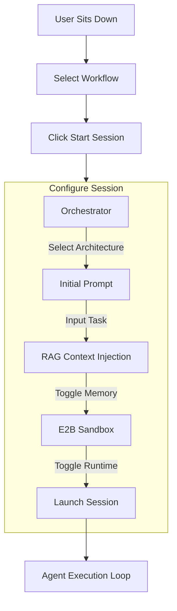

# Super Agent Monitor - User Guide

## Quickstart: Getting Started

Follow these steps to launch your first agent session.

1. **Navigate to Workflows:** Click on the "Workflows" tab in the sidebar.
2. **Select a Workflow:** Choose an existing workflow or create a new one.
3. **Start Session:** Click the "▶ Start Session" button in the top right.
4. **Configure Session:**
   - **Orchestration Strategy:** Select a "Council Architecture" (e.g., `orchestrator:default`). This defines the agent's high-level reasoning process.
   - **Initial Prompt:** Enter your task or question.
   - **Context Injection:** Leave checked to enable "Council Memory" (injects relevant project history).
   - **E2B Sandbox:** Check this if you want to run the agent in a secure, isolated cloud environment.
5. **Launch:** Click "Start Session".

## Visual Workflow

## Features Overview

### Council Architectures (Orchestrators)

The "Orchestration Strategy" dropdown allows you to select different "Council Architectures". These are high-level instructions that guide the agent's behavior.

- **Editable:** You can create or edit these architectures by adding Markdown files to `components/orchestrators/`.
- **Selection:** The dropdown automatically populates with all available orchestrators.

### Council Memory (RAG)

When "Enable Context Injection" is checked, the system performs a **Startup Context Injection**:

1. **Search:** It searches the project's memory bank for relevant past events, code snippets, and outcomes based on your Initial Prompt.
2. **Inject:** It inserts this context directly into the agent's system prompt before it starts.
3. **Benefit:** The agent starts with "knowledge" of previous work, reducing repetition and errors.

### E2B Sandbox

For tasks that involve executing code or interacting with the filesystem, use the E2B Sandbox.

- **Secure:** Runs in an isolated cloud environment.
- **Safe:** Prevents accidental damage to your local machine.
