# Visual Documentation & Methodologies

## 🗺️ User Journey & Progression Map

This diagram illustrates the "Quickstart" vs "Deep Dive" paths for using the Super Agent Monitor.

```mermaid
graph TD
    Start((Start)) --> Choice{Choose Mode}
    
    subgraph Quickstart ["🚀 Quickstart (The 'Magic Box')"]
        Choice -->|I have a task| Input[Input Task/Prompt]
        Input --> Auto[Adaptive Router (Auto-Council)]
        Auto -->|Deconstructs| Plan[Generated Plan]
        Plan -->|Executes| Agent[Agent Runtime]
        Agent -->|Feedback| UI[Live Monitor]
    end
    
    subgraph DeepDive ["🤿 Deep Dive (The 'Architect')"]
        Choice -->|I want control| Builder[Agent/Workflow Builder]
        Builder -->|Edit| Templates[Templates & Skills]
        Builder -->|Compose| CustomPlan[Custom Workflow]
        CustomPlan -->|Deploy| Agent
    end
    
    UI -->|Review| History[Session History]
    UI -->|Intervene| Kick[Kick/Stop]
    UI -->|Analyze| Metrics[Cost & Performance]
```

---

## 🧬 Agent Lineages & Methodologies

### 1. The Researcher (Deep Dive Protocol)
*   **Goal**: Exhaustive information gathering and synthesis.
*   **Methodology**: Recursive decomposition and parallel execution.

```mermaid
sequenceDiagram
    participant User
    participant Council as 🧠 Council
    participant Search as 🔍 Search Tools
    participant Writer as 📝 Synthesizer

    User->>Council: "Research X"
    Council->>Council: Deconstruct into Sub-topics
    par Parallel Research
        Council->>Search: Search Topic A
        Council->>Search: Search Topic B
        Council->>Search: Search Topic C
    end
    Search-->>Council: Raw Results
    Council->>Writer: Send Results & Context
    Writer->>Writer: Synthesize & Cite
    Writer-->>User: Final Report
```



### 2. The Coder (RCR Protocol)
*   **Goal**: High-quality, bug-free code implementation.
*   **Methodology**: Reflect-Critique-Refine (RCR) loop.


### 3. The Planner (Adaptive Council)
*   **Goal**: Strategic task decomposition and resource allocation.
*   **Methodology**: OODA Loop (Observe, Orient, Decide, Act).

```mermaid
flowchart LR
    Input[User Request] --> Observe
    
    subgraph Council_Mind ["🧠 Council Mind"]
        Observe[Observe Context] --> Orient[Orient (RAG + History)]
        Orient --> Decide[Decide Strategy]
        Decide --> Act[Act (Delegate)]
        Act -->|Feedback| Observe
    end
    
    Act --> Output[Sub-Agent Deployment]
```
